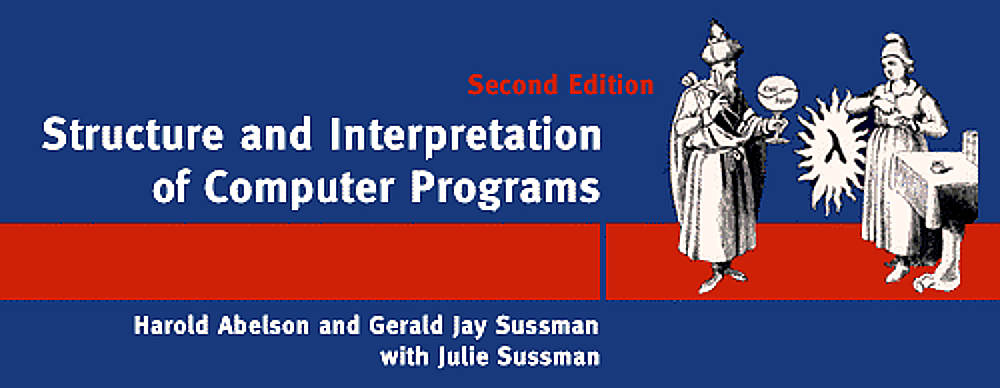

# SICP

Code and solutions to selected exercises from the masterpiece _**"Structure and Interpretation of Computer Programs"**_, 2nd Edition, by Harold Abelson and Gerald Jay Sussman with Julie Sussman ([MIT course](https://ocw.mit.edu/courses/electrical-engineering-and-computer-science/6-001-structure-and-interpretation-of-computer-programs-spring-2005/)).

SICP is a computing textbook, published by MIT in two editions (1985, 1995) and noted for it’s ambitious approach to instruction in the logic of computer programming.

> Those who hate SICP think it doesn’t deliver enough tips and tricks for the amount of time it takes to read. But if you’re like me, you’re not looking for one more trick, rather you’re looking for a way of synthesizing what you already know, and building a rich framework onto which you can add new learning over a career. That’s what SICP has done for me. I read a draft version of the book around 1982, when I was in grad school, and it changed the way I think about my profession. If you’re a thoughtful computer scientist (or want to be one), it will change your life too.
>
> – Peter Norvig

[The full text of the book can be found here.](https://mitpress.mit.edu/sites/default/files/sicp/index.html)

[MIT/GNU Scheme](https://www.gnu.org/software/mit-scheme/)
